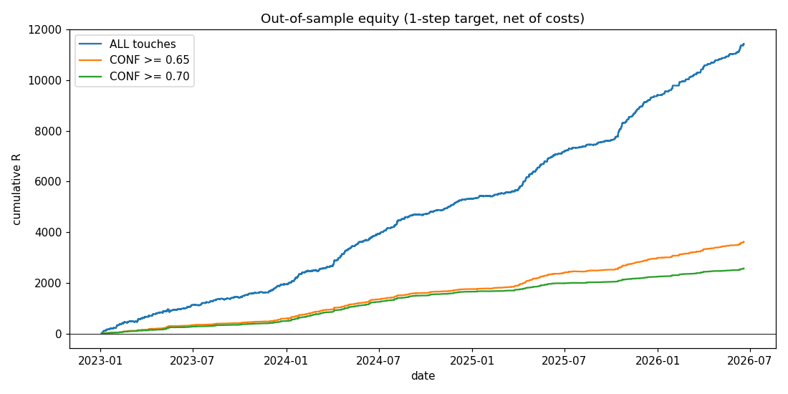
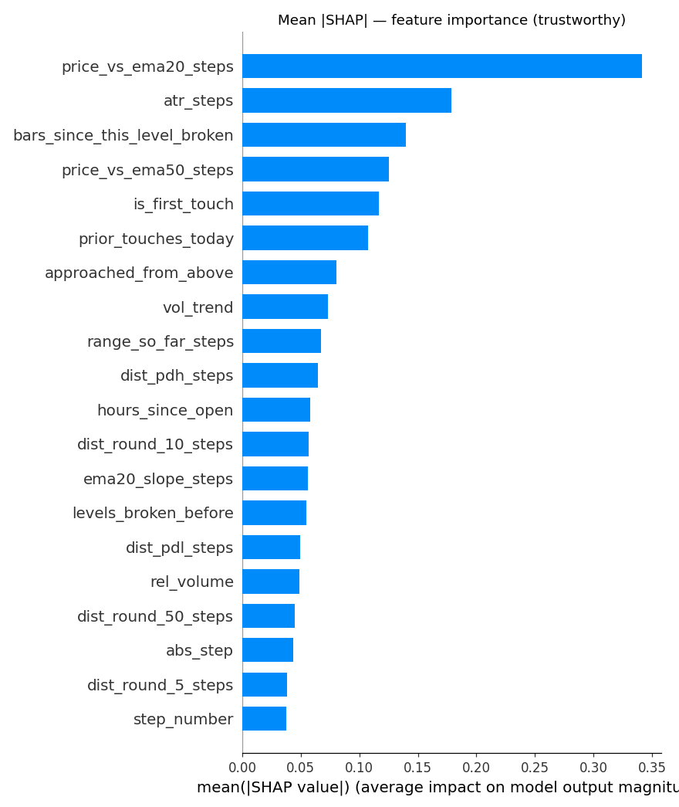

# 🪙 Gold Ladder-Level Strength Predictor

> Calibrated machine-learning probabilities for **which gold (XAU/USD) price levels will hold vs break** — each trading day, from the daily open.

[](https://share.streamlit.io/)
[](https://www.python.org/)
[](https://lightgbm.readthedocs.io/)


> ▶️ **Live demo:** _deploy on Streamlit Community Cloud and paste the link here_ (steps in [Run the live demo](#-run-the-live-demo)).

---

## What it does

Every gold session opens at a price. From that open we build a fixed **ladder of 21 levels** (10 below, the open, 10 above) using a deterministic formula. Traders watch these levels as intraday support/resistance — but which ones actually *hold*?

This project trains a model on **15 years of XAU/USD data (2011–2026)** to answer that, per level, as an **honest probability**:

- **React (hold)** — price touches the level and turns away.
- **Break** — price pushes straight through.

You type the day's open, and the app shows all 21 levels ranked with a calibrated **react %** and a plain-English reason for each. It also generates a copy-paste **TradingView Pine** snippet that prints those percentages above each line on your chart.

The key property is **calibration**: when the model says *70%*, about *70%* of those levels really do hold (verified out-of-sample). That's the difference between a number you can size a trade on and a guess.



---

## Results (out-of-sample)

**Model quality** — LightGBM + isotonic calibration vs baselines (held-out test):

| Model | ROC-AUC | PR-AUC | Brier ↓ |
|---|---|---|---|
| No-skill (base rate) | 0.500 | 0.387 | 0.238 |
| Logistic regression | 0.552 | 0.439 | 0.244 |
| **LightGBM (calibrated)** | **0.697** | **0.584** | **0.210** |

**Walk-forward** (retrain each year, test on the *next* year — never peeking ahead):

| Test year | ROC-AUC | Hit-rate @ ≥70% conf |
|---|---|---|
| 2023 | 0.703 | 83% |
| 2024 | 0.718 | 78% |
| 2025 | 0.697 | 84% |
| 2026 | 0.697 | 72% |

**Costed backtest** ($0.30 round-trip). The edge is concentrated at high confidence:

| Confidence gate | Trades | Win rate | Expectancy | Profit factor |
|---|---|---|---|---|
| All touches | 22,299 | 37% | +0.51R | 1.6 |
| **≥ 0.65** | 1,831 | **67%** | **+1.98R** | **5.4** |
| **≥ 0.70** | 1,225 | **71%** | **+2.10R** | **5.9** |
| ≥ 0.80 | 514 | 75% | +2.31R | 7.4 |

> The model is near a coin-flip on the *average* level (base react rate ≈ 39%). Its value is at the **extremes** — the high-confidence reacts and the near-certain breaks — which is exactly where you trade.

---

## How it works

```
Dukascopy ticks ──► clean / resample (M5·M15·H1·H4·D1)
        │                FOREX.com daily opens (anchor levels to the broker you trade)
        ▼
  build 21 ladder levels per day  ──►  detect touches (M15)  ──►  label react/break (M5)
        ▼
  33 leakage-safe features per touch  (trend · volatility · prior-day refs ·
        round-number magnets · cross-day confluence · volume · approach side)
        ▼
  LightGBM (gradient-boosted trees)  ──►  isotonic calibration  ──►  honest react %
        ▼
  walk-forward validation · costed backtest · SHAP explanations · Streamlit app · Pine export
```

- **Model:** LightGBM (gradient-boosted decision trees) — best-in-class for tabular data, handles missing values and feature interactions natively. A monotone **isotonic** layer turns raw scores into trustworthy probabilities.
- **Leakage guard:** every feature uses only bars **≤ the touch time**. An `assert_no_leakage` check rebuilds random touches on truncated data and requires identical features. Distances are in **step-size units** (dimensionless), so the model transfers across price regimes.
- **Top drivers** (by gain): short/medium-term trend (`price_vs_ema20/50`), trend slope, freshness after a break, volatility (`atr_steps`), distance to prior-day high/low.

See [`PROJECT_MASTER_HANDOFF.md`](PROJECT_MASTER_HANDOFF.md) for the full design and [`FEATURES.md`](FEATURES.md) for every feature.



---

## Repo structure

```
src/        pipeline: fetch → levels → labels → features → train → calibrate → backtest → explain
app/        daily_tool.py  (Streamlit dashboard)  +  pine_template.pine  (TradingView export)
models/     trained LightGBM + calibrator (lgbm_calibrated.joblib) + metrics
reports/    walk-forward metrics, backtest summary, equity curve, SHAP plots, operating points
data/       processed parquets the app needs (heavy raw history is git-ignored — regenerate via src/)
tests/      level-formula + pipeline tests
```

---

## Run locally

```bash
pip install -r requirements.txt          # Python 3.10
streamlit run app/daily_tool.py          # the dashboard
```

Headless score (no browser):

```bash
python3 app/daily_tool.py --demo 3300            # score an open of 3300
python3 app/daily_tool.py --demo 3300 2026-06-18 # ... as of a given date
```

Rebuild the full dataset from scratch (the heavy raw data is not committed):

```bash
python3 src/fetch_data.py && python3 src/build_levels.py && \
python3 src/build_labels.py && python3 src/build_features.py && \
python3 src/train_model.py && python3 src/walkforward_backtest.py
```

---

## 🌐 Run the live demo

Deploy free on **Streamlit Community Cloud**:

1. Go to **[share.streamlit.io](https://share.streamlit.io/)** → sign in with GitHub.
2. **New app** → pick `RohitZinge/gold-level-predictor`, branch `main`, main file `app/daily_tool.py`.
3. **Advanced settings → Python version: 3.10** (matches the pinned libraries).
4. **Deploy.** Once it's live, copy the `*.streamlit.app` URL into the badge at the top of this README.

---

## ⚠️ Disclaimer

This is a **research project**, not financial advice. Markets are uncertain; a calibrated probability tilts the odds, it does not guarantee an outcome. Trade your own risk.
